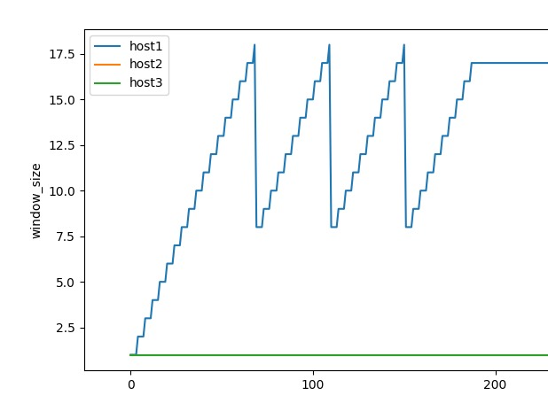
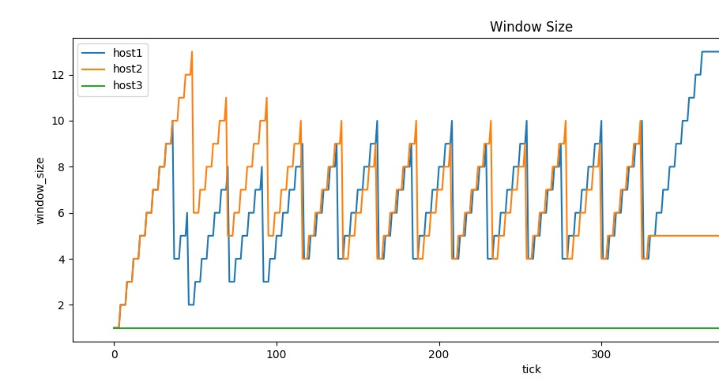
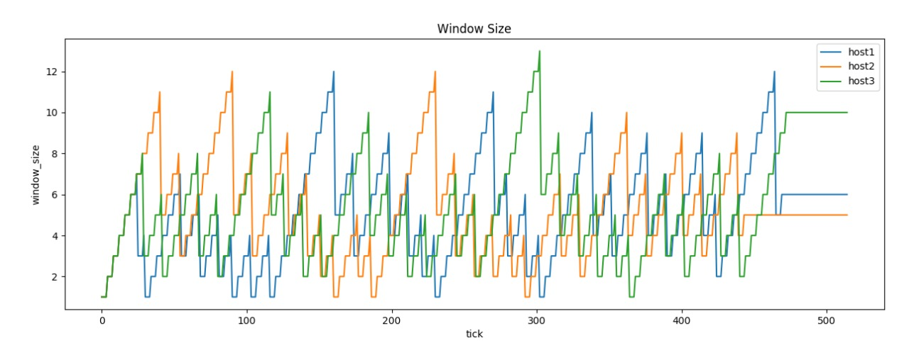
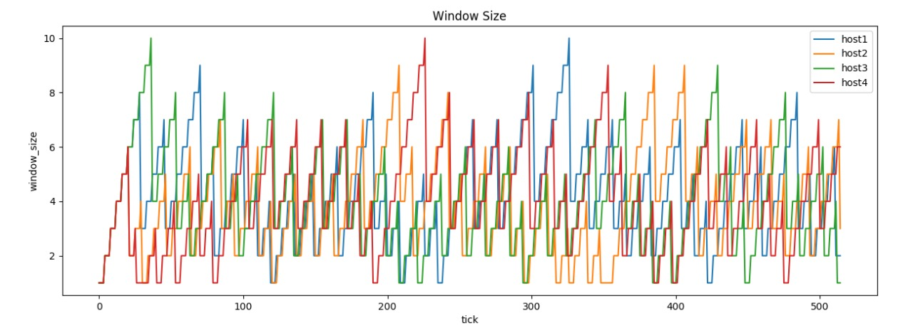

# TCP Congestion Control - A Machine Learning Approach

An attempt to apply machine learning for tcp congestion control. This is our CS359 computer networks project. We have made a simple network simulator to test our algorithms. First we implemented a simplified TCP Tahoe. Then we collected data from it and trained a polynomial regression model. Finally we used the model and collected the results below.

Install dependencies using:
```
python3 -m pip install -U -r requirements.txt
```

To run the model:
```
python3 ./src/main.py
```

## Results:
<p align="center"><br>
1 host
<p>
<br>

<p align="center"><br>
2 hosts</p>
<br>

<p align="center"><br>
3 hosts</p>
<br>

<p align="center"><br>
4 hosts</p>
<br>

As can be seen from above, the algorithm divides the available bandwidth fairly equally.

## Contributors:
- [aryadas98](https://github.com/aryadas98)
- [ankurD98](https://github.com/ankurD98)
- [atul337](https://github.com/atul337)
